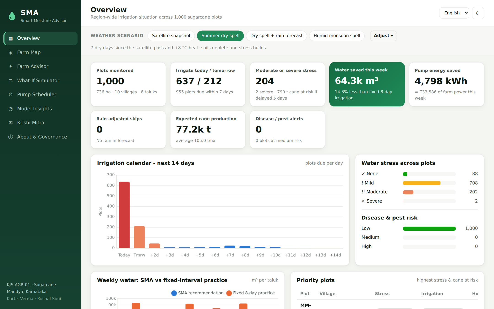

# SMA - Smart Moisture Advisor

**AI-driven irrigation advisory system for sugarcane**, built for use case **KJS-AGR-01** (K J Somaiya Institute of Technology × KIAAR × Godavari Biorefineries).

SMA turns satellite, soil and weather data for every geofenced plot into plot-specific advice:
**when** to irrigate, **how long** to run the pump, **how much fertiliser** to apply, and **what is at stake** if irrigation is delayed. The advice is available in English, ಕನ್ನಡ, हिंदी and मराठी.

**Team:** Kartik Verma · Kushal Soni



---

## Contents

- [Features](#features)
- [Quick start](#quick-start)
- [Using the app (tour)](#using-the-app-tour)
- [How it works](#how-it-works)
- [Model performance](#model-performance)
- [Project structure](#project-structure)
- [Retraining the models](#retraining-the-models)
- [REST API](#rest-api)
- [Project report](#project-report)
- [Presentation](#presentation)
- [Limitations & roadmap](#limitations--roadmap)

---

## Features

| | Feature | What it does |
|---|---|---|
| 💧 | **Next-irrigation prediction** | Random Forest predicts days until irrigation is needed, with ± uncertainty from the spread across trees |
| ⏱ | **Irrigation duration** | Predicts depth (mm), then converts it to water volume (m³) and pump hours for flood, furrow, sprinkler or drip |
| 🌱 | **Crop water requirement** | Gradient Boosting predicts ETc (mm/day) from climate, crop age and NDVI |
| 🌡 | **Water-stress probability** | 4-class probabilities (None / Mild / Moderate / Severe) |
| 🌧 | **Rainfall-adjusted advice** | Forecast rain is a model input, plus a "no-rain" counterfactual → "skip irrigation" advice |
| ⏳ | **Yield loss from delay** | Gradient Boosting model of % yield lost if irrigation slips 0-14 days |
| 🌾 | **Yield prediction** | Expected cane yield (t/ha and t per plot) |
| 🐛 | **Disease & pest risk** | Risk classifier plus fungal / shoot-borer typing |
| 🧪 | **Fertigation plan** | Stage-wise NPK (250:100:125) converted to kg of urea, 12-61-0 and MOP, adjusted for organic carbon, pH and vigour |
| ⚡ | **Pump scheduling optimiser** | WSPT scheduling within 3-phase power windows and feeder capacity, compared with a first-come rotation (Gantt chart) |
| 🗺 | **Farm map** | Leaflet map of all 1,000 plot polygons, coloured by any prediction layer |
| 🧭 | **Management zones** | K-Means clustering of plots into 4 agronomic zones |
| 🔍 | **Explainability** | "Why this advice?" per-feature effects, feature importances, confusion matrices |
| 🗣 | **Multilingual advisory** | EN / KN / HI / MR text, read-aloud (speech synthesis), copy as SMS |
| 🤖 | **Krishi Mitra chatbot** | Ask "When should I irrigate MM-MD-0110?" in any of the 4 languages |
| 🙋 | **Human-in-the-loop** | Accept / override every advisory; overrides are logged for retraining |
| ⚗ | **What-if simulator** | Move sliders and watch all 7 models respond live |
| 🌓 | **Polished UI** | Light / dark themes, responsive layout, colour-blind-safe chart palette |

---

## Quick start

### Requirements
- **Node.js 18 or newer** ([download](https://nodejs.org)). This is all you need to run the app.
- *(Optional)* **Python 3.9+** only if you want to retrain the models.

### Run

```bash
git clone <this-repo-url> SMA
cd SMA
npm install          # installs express, csv-parse, chart.js, leaflet
npm start            # → http://localhost:3000
```

Open **http://localhost:3000** in your browser. The trained models are already in `models/`, so no Python is needed.

| Command | Purpose |
|---|---|
| `npm start` | Start the server (port 3000; change with `PORT=4000 npm start`) |
| `npm run dev` | Start with auto-reload on file changes |
| `npm test` | Run the 23 automated tests (models, engine, API) |
| `npm run train` | Retrain all models with Python (see below) |

> **Windows:** use `set PORT=4000 && npm start` to change the port.
> **Offline:** everything works offline except the satellite / street basemap tiles on the Farm Map.

---

## Using the app (tour)

1. **Weather scenario bar** (top): choose a preset or click **Adjust** to set the forecast rain, temperature anomaly, humidity anomaly, dry days since the satellite pass, irrigation method and pump flow. Every page updates.
   - *Satellite snapshot*: data as observed (moist, monsoon-season pass)
   - *Summer dry spell*: 7 dry days and +8 °C, so stress builds
   - *Dry spell + rain forecast*: 40 mm forecast, so SMA postpones irrigation
   - *Humid monsoon spell*: fungal disease risk rises
2. **Overview**: KPIs, 14-day irrigation calendar, stress and risk distribution, water use by taluk vs fixed practice, priority plots, and a taluk / village table.
3. **Farm Map**: plots coloured by irrigation due, stress, NDVI, soil moisture, zone or risk. Click a plot for its summary.
4. **Farm Advisor**: enter a plot ID (e.g. `MM-MD-0110`) to get the full advisory. Switch language (top-right), press **Read aloud**, and accept or override the advice.
5. **What-If Simulator**: presets such as *Heat wave, dry soil*, plus sliders for all inputs.
6. **Pump Scheduler**: choose a village, power windows and feeder capacity, then click **Optimise schedule**.
7. **Model Insights**: pipeline, model accuracy vs baselines, feature importance, predicted-vs-actual, confusion matrices, correlations, zones and data quality.
8. **Krishi Mitra**: a multilingual chatbot.
9. **About & Governance**: coverage of the 11 use-case models and responsible-AI design.

---

## How it works

```
IrrigationAdvisoryDataset.csv (1,000 plots, Mandya)
        │
        ▼
ml/train.py  (Python, offline)
  1. clean      - impute cloud-masked NDVI (village median), drop constant columns
  2. augment    - 12 seasonal scenarios per plot (crop age, heat, dry spells, rain) → 12,000 rows
  3. label      - FAO-56 water balance + FAO-33 yield response (ml/agronomy.py) + field noise
  4. train      - Random Forest / Gradient Boosting, GroupShuffleSplit by plot (no leakage)
  5. evaluate   - vs linear / logistic baselines → models/metrics.json
  6. export     - every tree → models/*.json   (+ test fixtures for parity tests)
        │
        ▼
Node.js server (src/)
  ml/treeEnsemble.js   pure-JS tree inference (bit-exact with scikit-learn)
  engine/advisory.js   predictions → irrigation / fertigation / risk advisory
  engine/scheduler.js  pump scheduling (WSPT) under power windows
  engine/explain.js    "why this advice?" sensitivity analysis
  engine/i18n.js       EN / KN / HI / MR advisory text
  engine/chat.js       Krishi Mitra chatbot
  app.js               REST API + static web app
        │
        ▼
public/  (vanilla JS single-page app, Chart.js, Leaflet)
```

### Why "physics-informed" labels?
The dataset has **no ground-truth labels**: no irrigation logs and no yield records. We therefore generate labels from established agronomy (FAO-56 crop water balance and FAO-33 yield response), add realistic noise, and train ML models on them. When KIAAR / GBL field data becomes available, the same pipeline retrains on real labels with no code changes. Full details are in [`docs/METHODOLOGY.md`](docs/METHODOLOGY.md).

---

## Model performance

Evaluated on **200 plots never seen in training** (group split by plot):

| Model | Algorithm | Test score | Baseline |
|---|---|---|---|
| Next irrigation (days) | Random Forest | R² 0.965, MAE 0.69 d | Linear R² 0.744 |
| Crop water requirement (mm/day) | Gradient Boosting | R² 0.977, MAE 0.17 | Linear R² 0.884 |
| Irrigation depth (mm) | Gradient Boosting | R² 0.975, MAE 1.75 | Linear R² 0.621 |
| Cane yield (t/ha) | Gradient Boosting | R² 0.892, MAE 3.36 | Linear R² 0.571 |
| Yield loss from delay (%) | Gradient Boosting | R² 0.976, MAE 0.36 | Linear R² 0.499 |
| Water-stress class | Random Forest | Acc 87.8%, F1 0.82 | Logistic 83.5% |
| Disease & pest risk | Random Forest | Acc 87.3%, F1 0.76 | Logistic 82.0% |

Scores are regenerated in `models/metrics.json` every time you train.

---

## Project structure

```
SMA/
├── server.js                 # entry point (npm start)
├── src/
│   ├── app.js                # Express app + REST API
│   ├── config.js             # defaults: scenario, irrigation methods, pump, baseline practice
│   ├── data/farms.js         # CSV loading, cleaning, outlier flags, polygons
│   ├── ml/treeEnsemble.js    # JSON tree-ensemble inference
│   ├── ml/registry.js        # loads models, K-Means zone assignment
│   └── engine/               # advisory, agronomy, scheduler, explain, insights, i18n, chat
├── public/                   # web app (index.html, css/, js/pages/*)
├── ml/
│   ├── agronomy.py           # FAO-56 / FAO-33 label engine
│   ├── train.py              # training + evaluation + export
│   └── requirements.txt
├── models/                   # trained models (JSON), metrics.json, test_fixtures.json
├── data/IrrigationAdvisoryDataset.csv
├── test/                     # node:test suites (models parity, engine, API)
├── docs/                     # METHODOLOGY.md, API.md
└── presentation/             # SMA_Presentation.pptx, PRESENTATION_GUIDE.md, deck + screenshot scripts
```

---

## Retraining the models

```bash
python3 -m venv .venv && source .venv/bin/activate     # Windows: .venv\Scripts\activate
pip install -r ml/requirements.txt
npm run train          # or: python3 ml/train.py   (about 1-2 minutes)
npm test               # confirms the Node inference matches the new Python models
```

To use a different or updated dataset with the same columns, replace `data/IrrigationAdvisoryDataset.csv`, or point the server at another file with `SMA_DATA=/path/to/file.csv npm start`.

---

## REST API

All endpoints are under `/api`. The weather-scenario query parameters (`forecastRain`, `tempAnomaly`, `rhAnomaly`, `daysSinceObs`, `method`, `pumpFlow`) are accepted everywhere.

| Method | Endpoint | Description |
|---|---|---|
| GET | `/api/health` | Health check |
| GET | `/api/meta` | Taluks, villages, languages, defaults |
| GET | `/api/farms?taluk=&village=` | Summary advisory for every plot |
| GET | `/api/farms/geo` | Plot polygons |
| GET | `/api/farms/:id?lang=kn&cropAge=` | Full advisory for one plot |
| POST | `/api/predict` | What-if prediction for arbitrary inputs |
| GET | `/api/insights` | Region analytics (KPIs, calendar, taluks, correlations, zones) |
| POST | `/api/schedule` | Optimised pump schedule |
| GET | `/api/models` | Model metrics & metadata |
| POST | `/api/feedback` · GET `/api/feedback` | Human-in-the-loop accept / override log |
| POST | `/api/chat` | Krishi Mitra chatbot |

Examples and request bodies are in [`docs/API.md`](docs/API.md).

---

## Project report

The Major Project-B report in the KJSIT format is in [`report/`](report/):
[`SMA_Major_Project_Report.docx`](report/SMA_Major_Project_Report.docx) (Word, editable) and a PDF preview.
See [`report/README.md`](report/README.md) for what to fill in before submission and how to rebuild it.

## Presentation

- **Slides:** [`presentation/SMA_Presentation.pptx`](presentation/SMA_Presentation.pptx): 16 slides with speaker notes (the full script)
- **Script, demo run-sheet, Q&A prep and tips:** [`presentation/PRESENTATION_GUIDE.md`](presentation/PRESENTATION_GUIDE.md)

---

## Limitations & roadmap

**Limitations**
- Labels are generated from FAO agronomy, not field records.
- Crop age is not in the dataset, so a stable estimate is used per plot (override it in the Advisor).
- There is one satellite snapshot. Dry spells and weather are simulated through the scenario bar.
- Kannada, Hindi and Marathi texts are templates and should be reviewed by native speakers.
- Water and energy savings are model estimates against a fixed 8-day, 70 mm baseline.

**Roadmap**: IoT soil sensors and real irrigation logs → retrain; daily IMD forecast and Sentinel-2 feeds; LLM advisories over WhatsApp / IVR; mobile app and STEPS integration; automatic pump control inside optimised windows.

---

## License

MIT
